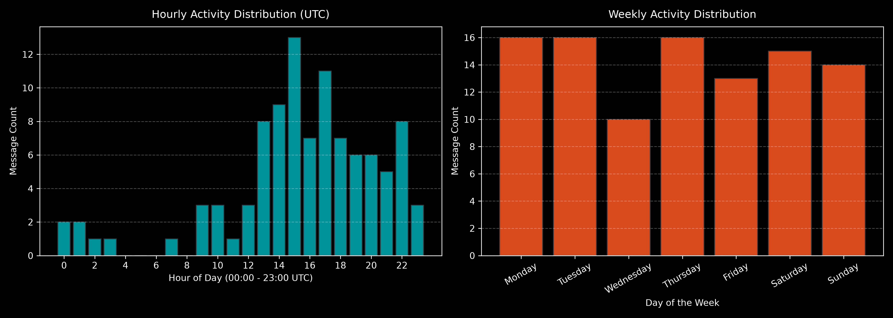

# 🛰️ Chronosgram: Telegram OSINT & Behavioral Activity Analyzer

An automated, lightweight Open Source Intelligence (OSINT) and Social Media Intelligence (SOCMINT) pipeline built in Python. This toolkit extracts data from static web endpoints and public Telegram channels without requiring API credentials, parses UTC timestamps, and profiles operational activity patterns.

---

## 📌 Features

- **No-API Telegram Extraction:** Scrapes public channel history, views, post IDs, external links, and ISO 8601 timestamps using Telegram's web preview.
- **Web Scraping Module:** Multi-page parsing using `BeautifulSoup`.
- **Chronological Data Formatting:** Cleans and sorts unstructured event logs with `pandas`.
- **Behavioral Profiling (Timezone / Routine):** Generates dark-themed analytical visualizations using `matplotlib` to identify operational peak hours and weekly activity routines.

---

## 📊 Sample Visual Intelligence Output



---

## 🚀 Installation & Usage

1. **Clone the repository:**
  
   ``` Bash
git clone https://github.com/alpakciger/Chronosgram.git 
cd Chronosgram
   ```

2. **Set up virtual environment & install dependencies:**

```Bash
python3 -m venv venv
source venv/bin/activate
pip install -r requirements.txt
```
3. **Run the Telegram Scraper:**

```Bash
python3 telegram_scraper.py
```
## ⚙️ Architecture & Pipeline Flow

```text

[ Target Channel ] 
       │
       ▼
[ HTTP Web Preview Scraper (Requests + BeautifulSoup) ]
       │
       ▼
[ Data Cleaning & Regex Sanitization (Pandas) ] ───► Generates: telegram_<channel>.json
       │
       ▼
[ Behavioral Analyzer & Temporal Profiler (Matplotlib) ] ───► Generates: report_telegram_<channel>.png

```

---
## ⚖️ Disclaimer & Ethics
This tool is intended strictly for educational, security research, and open-source intelligence analysis purposes. Ensure compliance with platform Terms of Service and applicable data governance policies.
